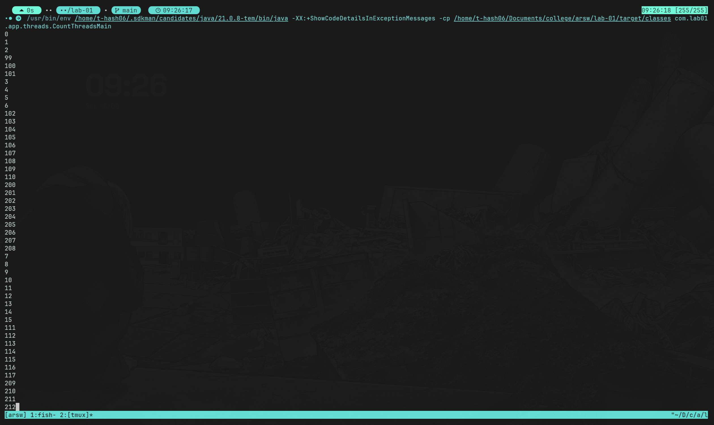

## Punto I: Hilos de conteo

### Resumen
Se implementó un hilo que imprime números en un rango y se creó un `main` que lanza 3 hilos con intervalos específicos para correr en paralelo.

### Pasos realizados
1. Implementación de `CountThread`:
	- Extiende `Thread`.
	- Constructor recibe `start` y `end` (rango inclusivo).
	- `run()` imprime los números del rango. Si el rango viene invertido, cuenta en sentido contrario.
2. Actualización de `CountThreadsMain`:
	- Crea tres hilos con los intervalos: `[0..99]`, `[99..199]` y `[200..299]`.
	- Inicia los hilos con `start()` para ejecución concurrente.

### Cómo probar
- Ejecutar `com.lab01.app.threads.CountThreadsMain`.
- La salida muestra los números de los tres rangos intercalados por concurrencia.

### Preguntas

1) ¿Qué pasa al ejecutar con `start()`?

- Los tres hilos se ejecutan concurrentemente y la salida por consola se mezcla (las líneas de los distintos rangos aparecen intercaladas de forma no determinista).
- Esto ocurre porque `start()` crea hilos independientes que el sistema planifica y ejecuta en paralelo. `System.out.println` asegura líneas completas, pero no el orden entre hilos.

2) ¿Qué pasa si se usa `run()` en lugar de `start()`?

- Llamar a `run()` ejecuta el código en el hilo actual (main). La ejecución será secuencial: primero todo el primer rango, luego el segundo, luego el tercero.
- No se crean nuevas unidades de ejecución al usar `run()`.

## Punto II: Búsqueda en listas negras con N hilos

### Resumen
Se paralelizó la validación de IPs en listas negras dividiendo el espacio de servidores entre N hilos. Se creó un hilo que busca en un segmento, se sobrecargó `checkHost` para aceptar N, se agregaron los resultados de todos los hilos y se mantuvo un LOG verídico del número de listas revisadas. `Main` permite pasar N como argumento (por defecto 1).

### Pasos realizados
1. Implementación de `BlacklistSearchThread`:
	- Extiende `Thread`.
	- Constructor recibe fachada, IP, `inicio` y `fin` del rango [inicio, fin).
	- `run()` recorre su segmento, acumula IDs de listas donde aparece la IP y cuenta cuántas listas revisó.
	- Expone `getFound()` y `getChecked()`.
2. Actualización de `HostBlackListsValidator`:
	- Nuevo `checkHost(String ip, int nThreads)` que divide `getRegisteredServersCount()` en N partes balanceadas.
	- Lanza N hilos, hace `join()` a todos, agrega ocurrencias y decide si reporta como confiable/no confiable según el umbral.
	- Mantiene el LOG con la suma real de listas revisadas vs el total.
	- Se conserva `checkHost(String ip)` delegando a N=1 para compatibilidad.
3. Actualización de `Main`:
	- Acepta N como primer argumento. Si no se pasa, usa 1.

### Cómo probar
- Ejecutar `com.lab01.app.blacklistvalidator.Main` opcionalmente con N:
  - Ejemplo: N=1 (serial) o N=8 (paralelo). Se mostrará el LOG “Checked Black Lists:X of Y” y la lista de IDs encontrados.
- Para validar casos del enunciado, cambiar la IP en `Main` y ejecutar con distintos N:
  - `200.24.34.55`: reportado como NO confiable rápidamente.
  - `202.24.34.55`: reportado como NO confiable con ocurrencias dispersas.
  - `212.24.24.55`: reportado como confiable (lista vacía).

### Preguntas
1) ¿Se mantiene verídico el LOG de listas revisadas vs total?

- Sí. Se suma `getChecked()` de cada hilo y se reporta junto con el total de servidores registrados.

2) ¿Qué pasa con distintos valores de N?

- Si N ≤ 0 se normaliza a 1; si N > total de servidores se limita a ese total. La división del trabajo reparte uniformemente el residuo para balancear los segmentos.

3) ¿Se detiene la búsqueda global al alcanzar 5 ocurrencias entre todos los hilos?

- No. Esta optimización cruzada entre hilos corresponde al punto II.I para discutir. La implementación actual espera a que todos los hilos terminen y luego decide.